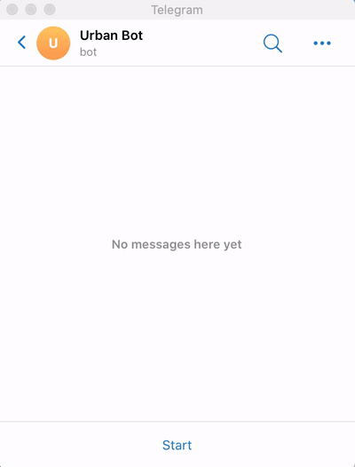

# Urban Bot
Universal chatbot library based on React.

## Installation
```
$ npm i urban-bot urban-bot-telegram react
```

## Simple example

```javascript
import React from 'react';
import { render, Route, Router, Root, Text, ButtonGroup, Button, useText } from 'urban-bot';
import { UrbanBotTelegram } from 'urban-bot-telegram';

function Echo() {
    const [text, setText] = React.useState('Say something');

    useText(({ text }) => {
        setText(text);
    });

    return (
        <Text isNewMessageEveryRender>
            <i>{text}</i>
        </Text>
    );
}

function Counter() {
    const [count, setCount] = React.useState(0);

    const increment = () => setCount(count + 1);
    const decrement = () => setCount(count - 1);

    return (
        <ButtonGroup title={count}>
            <Button onClick={increment}>+1</Button>
            <Button onClick={decrement}>-1</Button>
        </ButtonGroup>
    );
}

function App() {
    return (
        <Router>
            <Route path="/echo">
                <Echo />
            </Route>
            <Route path="/counter">
                <Counter />
            </Route>
        </Router>
    );
}

render(
    <Root
        bot={
            new UrbanBotTelegram(token, {
                polling: true,
            })
        }
    >
        <App />
    </Root>
);

```
