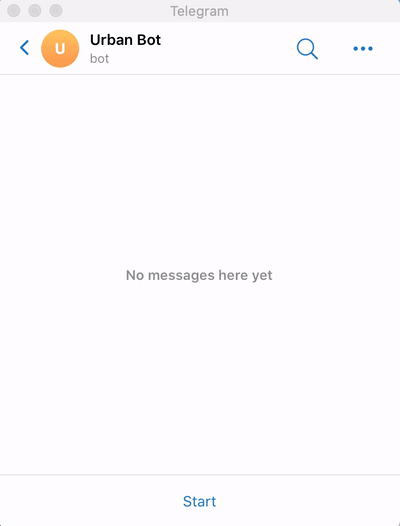
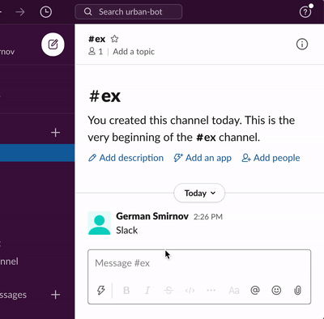

[](https://www.npmjs.com/package/@urban-bot/core)

# Urban Bot

Universal chatbot library based on [React](https://github.com/facebook/react).

* **Declarative.** You don't need to know any messenger API, just write simple react components.
* **Multiplatform.** Write once, launch any messenger.
* **Reusable.** Easy share logic between different chatbots or just use common parts.
* **Session.** App renders unique for every chat, so just write your app as if it is client-side rendering.
* **Types.** Full typescript support.

Currently, the library is under active development and has an alpha version status. But you can help us if you try to use it and understand conception. It is really easy if you have already known React. All available example [components](https://github.com/urban-bot/urban-bot/tree/master/examples/base/src) and [hooks](https://github.com/urban-bot/urban-bot/blob/master/examples/base/src/Hooks.tsx).

**Platforms we are supporting**

[](https://telegram.org/)
 [](https://slack.com/)
 [](https://www.messenger.com/)
 
 
**Soon**

[](https://www.discord.com/)
 [](https://www.whatsapp.com/)
 [](https://www.vk.com/)
 [](https://www.viber.com/)

## Installation
Please use our zero configuration [starter](https://github.com/urban-bot/urban-bot-starter).

Or install manually:
```
$ npm i react @urban-bot/core @urban-bot/telegram @urban-bot/slack
```

## Simple example


```javascript
import React from 'react';
import { render, Route, Router, Root, Text, ButtonGroup, Button, useText } from '@urban-bot/core';
import { UrbanBotTelegram } from '@urban-bot/telegram';
import { UrbanBotSlack } from '@urban-bot/slack';

function Echo() {
    const [text, setText] = React.useState('Say something');

    useText(({ text }) => {
        setText(text);
    });

    return (
        <Text isNewMessageEveryRender>
            <i>{text}</i>
        </Text>
    );
}

function Counter() {
    const [count, setCount] = React.useState(0);

    const increment = () => setCount(count + 1);
    const decrement = () => setCount(count - 1);

    return (
        <ButtonGroup title={count}>
            <Button onClick={increment}>+1</Button>
            <Button onClick={decrement}>-1</Button>
        </ButtonGroup>
    );
}

function App() {
    return (
        <Router>
            <Route path="/echo">
                <Echo />
            </Route>
            <Route path="/counter">
                <Counter />
            </Route>
        </Router>
    );
}

render(
    <Root
        bot={
            new UrbanBotTelegram(telegramToken, {
                polling: true,
            })
        }
    >
        <App />
    </Root>
);

render(
    <Root
        bot={
            new UrbanBotSlack({
                signingSecret: slackSigningSecret,
                token: slackToken,
            })
        }
    >
        <App />
    </Root>
);
```
