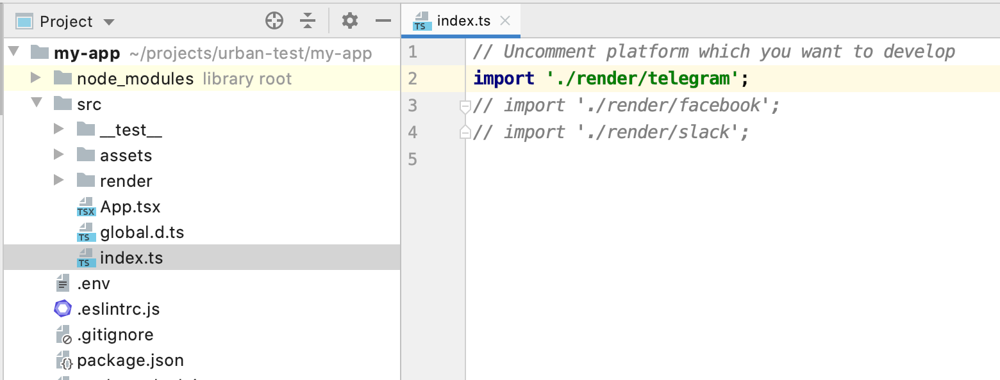

Instruction on how to start developing Telegram bot.

## Local development
### Video

<iframe width="560" height="315" src="https://www.youtube.com/embed/WqyOCZMDSpg" frameborder="0" allow="accelerometer; autoplay; encrypted-media; gyroscope; picture-in-picture" allowfullscreen></iframe>

### Steps

1. To start work with <a href="https://telegram.org/" target="_blank">telegram</a> you have to get <a href="https://core.telegram.org/bots#6-botfather" target="_blank">telegram token</a>
from <a href="https://t.me/botfather" target="_blank">@BotFather</a>. Write to BotFather `/newbot`, write display name of your new bot, then username and you should get telegram token.


2. Then open `my-app` directory which you have install via [`create-urban-bot`](intro.html#installation) and paste the telegram token to `.env` file.
<details>
<summary>telegram token in .env</summary>

</details>

3. After this open `src/index.ts` or `src/index.js` and uncomment `// import './render/telegram';`
<details>
<summary>src/index</summary>

</details>

4. Your bot is ready to launch! Run `npm run dev` in `my-app` directory and write something to your bot. It should work as default app with two commands `/echo` and `/logo`.

> If you see error looks like 
> `error: [polling_error] {"code":"EFATAL","message":"EFATAL: Error: connect ECONNREFUSED 127.0.0.1:9150"}`
> probably an internet provider blocks Telegram connection. You need to use a VPN, or you could use the Tor browser, see the [example](https://github.com/urban-bot/urban-bot/tree/master/examples/telegram-proxy-tor).

## Deploy
### Heroku
#### Video

<iframe width="560" height="315" src="https://www.youtube.com/embed/LttrosWEBPE" frameborder="0" allow="accelerometer; autoplay; encrypted-media; gyroscope; picture-in-picture" allowfullscreen></iframe>

#### Steps
1. Register on <a href="https://www.heroku.com" target="_blank">heroku</a> and install <a href="https://devcenter.heroku.com/articles/heroku-cli" target="_blank">heroku cli</a> and run `heroku login` in a terminal.
2. Go to a <a href="https://dashboard.heroku.com/new-app" target="_blank">new app</a> and create a new.
3. Go to your local urban-bot app folder if you have already one. For a new app do [the first three steps](#steps).
4. Paste heroku app url to `.env` file as `WEBHOOK_HOST`. You could get it from "Open app" button.
<details>
<summary>heroku open app button</summary>

</details>

5. Run `npx urban-bot set-webhook telegram` in a terminal from your local urban-bot app folder.

6. Paste telegram token to "Config Vars" section as `TELEGRAM_TOKEN` in heroku app settings [https://dashboard.heroku.com/apps/<YOUR_APP_NAME>/settings](https://dashboard.heroku.com/apps/<YOUR_APP_NAME>/settings).
<details>
<summary>heroku config vars</summary>

</details>

7. Run `git init` in your local urban-bot app folder if you did not.
8. Add git remote by run `heroku git:remote -a <YOUR_APP_NAME>`.
9. Deploy.
```shell
git add .
git commit -am "make it better"
git push heroku master -u
```
10. Check your bot!
