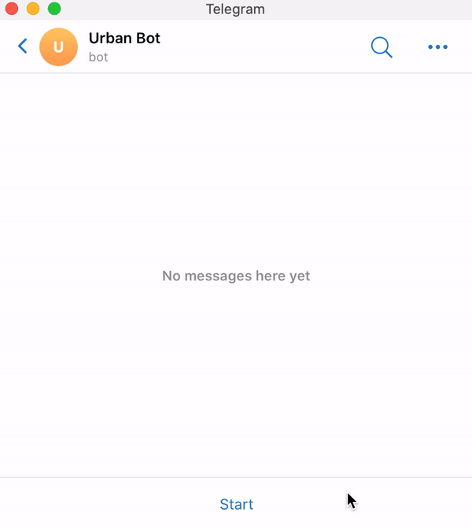

# Todo List

An example of how to create a simple todo list with Urban Bot and MobX.



```javascript
import React from 'react';
import { useText, Button, ButtonGroup, Text } from '@urban-bot/core';
import { observer } from 'mobx-react-lite';
import { Provider, useStore } from './mobx/connect';
import { store } from './mobx/store';
import { DELETE_TODOS_MODE } from './mobx/Mode';

const TodoListView = observer(function TodoListView() {
    const { todoList, mode } = useStore();

    function clickTodo(todo) {
        if (mode.mode === DELETE_TODOS_MODE) {
            todoList.deleteTodo(todo);
        } else {
            todo.toggle();
        }
    }

    useText(({ text }) => {
        todoList.addTodo(text);
    });

    if (todoList.todos.length === 0) {
        return <Text>Todo list is empty</Text>;
    }

    const title = todoList.todos.map((todo) => (
        <>
            {todo.isCompleted ? <s>{todo.text}</s> : todo.text}
            <br />
        </>
    ));

    const modeButton = (
        <Button key={mode.mode} onClick={() => mode.toggle()}>
            {mode.mode === DELETE_TODOS_MODE ? 'Delete mode' : 'Toggle mode'}
        </Button>
    );

    const todosButtons = todoList.todos.map((todo) => (
        <Button key={todo.id} onClick={() => clickTodo(todo)}>
            {todo.text}
        </Button>
    ));

    return (
        <ButtonGroup title={title} maxColumns={3}>
            {[modeButton, ...todosButtons]}
        </ButtonGroup>
    );
});

export function App() {
    return (
        <Provider value={store}>
            <Text>Welcome to todo list. Type your new todo.</Text>
            <TodoListView />
        </Provider>
    );
}
```
